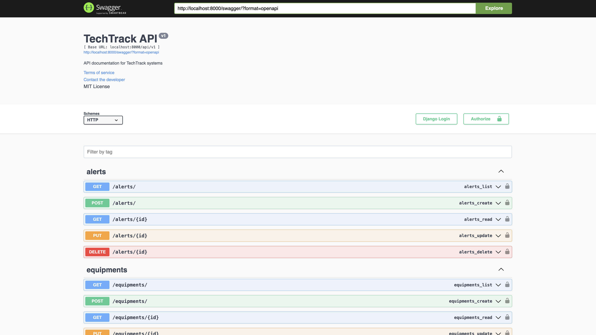
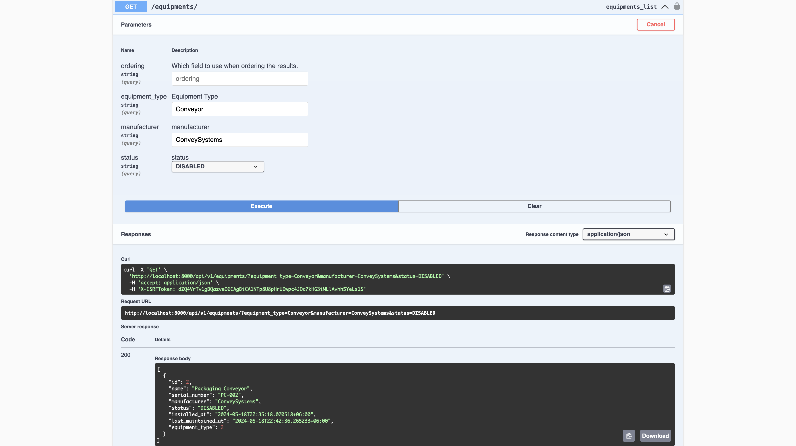

# TechTrack User Management API

**Customer company:** TechTrack

**Description of the task:**

TechTrack develops a platform for monitoring and managing technical equipment such as industrial robots, manufacturing equipment, quality control systems, etc. Currently, TechTrack faces challenges in managing data on the technical condition of equipment efficiently. This project involves developing a RESTful API to manage a list of users who interact with the monitoring platform. The API allows for the creation, reading, updating, and deletion (CRUD) of user data, and includes features for basic authentication and authorization.

**Assignment:**

Develop a RESTful API based on the provided specification to manage users. Ensure the API supports:

- 🛠️ CRUD operations for user management.
- 🔑 Basic authentication and authorization.
- 🔄 Ability to handle simultaneous requests from multiple clients.
- 📈 High data availability and robust error handling.

**Additional requirements:**

- 🐳 The application should be containerized using Docker.
- 📊 Integration with an existing system for monitoring technical equipment.
- 🔒 Secure handling and storage of user data.

**Restrictions:**

- 📝 Use Django and Django REST Framework for backend implementation.
- 🏗️ Follow RESTful design principles strictly.
- 🚫 The API must not store passwords in plain text.

**Answers to possible questions:**

- **Question:** How will you ensure the security of your API?
  - **Answer:** The API will implement token-based authentication and HTTPS to secure data transmissions. User passwords will be hashed before storage.

- **Question:** What measures will you take to ensure the performance of your API?
  - **Answer:** We will use query optimization, appropriate indexing, and pagination to manage database interactions efficiently. Load testing will be conducted to ensure the API can handle a high number of simultaneous requests.

- **Question:** How will you test your API?
  - **Answer:** Automated unit tests will be written using Django's testing framework for all models and views. Integration tests will ensure that the API components work together seamlessly.

- **Question:** What data formats will you use to pass information through the API?
  - **Answer:** The API will use JSON for data exchange because of its lightweight and easy-to-parse nature.

- **Question:** How will you ensure data consistency across parallel queries?
  - **Answer:** Database transactions and Django's concurrency controls will be used to ensure consistency and prevent race conditions.

## Screenshots

## Video Description of Work

For a detailed walkthrough of the API features and demonstration of user management, please view the following video:

[]
